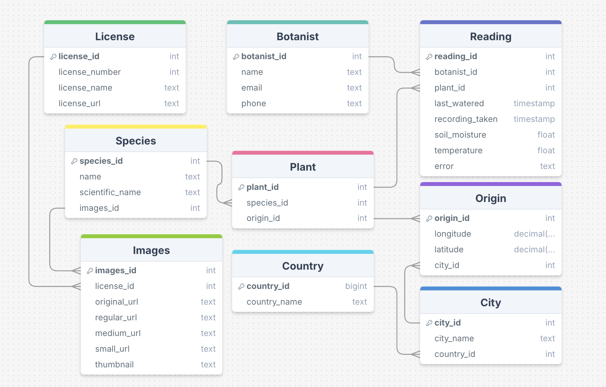

# LMNH Plant Health Monitoring Data Pipeline

# Project Description:
This project was built for the Liverpool Natural History Museum (LMNH) to aid them in monitoring the health of the plants found in their botanical wing. The LMNH has gardeners who are responsible for monitoring the plant health, but due to the number of plants with varying condition needs, monitoring can be very challenging.  

They are currently able to monitor live plant health on various environmental factors, such as soil moisture and temperature, via sensors that are connected to Raspberry PI (using digital input or analog input port), which is then further connected to the museum network. Raspberry PI analyses and processes all incoming data using custom built software on the PI, before reporting the data live via an API endpoint.

There are multiple issues that they are facing with their current set up which this project aims to help solve:

1. The gardeners are only able to see the current health of the plant, meaning they cannot track plant health over time
2. There is currently no system set up that alerts gardeners when there is a problem is plant health
3. The plant sensor hardware is not very resilient and can often give faulty data

# How the project works:
This project involved the creation of an automated ETL data pipeline which extracts plant health data from the pre-existing API every minute, transforms it so that the database is normalised and the data is cleaned and verified, before this data is then loaded into a database. Both short-term storage (including plant health data for the past 24 hours) and long-term storage (including historical daily summary data) is offered.

# How to run the code:
> Instructions on how to run the code (include examples?)

# ERD:
The diagram below shows our database design, including entity relationships between each table in our database, normalised to 3NF.

# Architecture Diagram:
The diagram below provides a visual representation of the AWS cloud system where our full data pipeline is being hosted, including how different services are connected to one another to help illustrate the data flow.

# Dashboard Wireframe:
The wireframe below displays the layout and structure plan for the data visualisation dashboard to be run on Streamlit

# Credits:
- Adam Cummings: Engineer & Analyst, Architect & DevOps
- Sami Lachqar: Engineer & Analyst, Architect & DevOps
- Ronn Marakkalsherry: Engineer & Analyst, Data & Business Analyst
- Dev Mukherjee: Engineer & Analyst, Project Manager
- Asia Siddiqi: Engineer & Analyst, QA Tester
