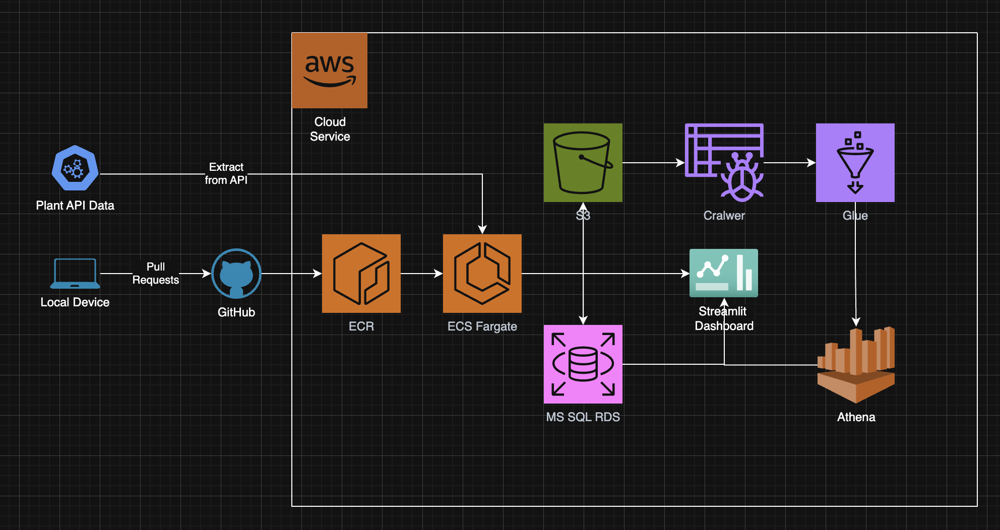

# LMNH-Group-Project 
> TO BE COMPLETED

# Project Description:
> What is this project for? What is the purpose here?

# How the project works:
> How does this project work? What does the code DO?

# How to run the code:
> Instructions on how to run the code (include examples?)

# ERD:

# Architecture Diagram:

# User Stories

## Hi, I'm a Gardener.

- I want to be alerted if the soil moisture is a concerning value (far outside average for a specific plant).
- Why? Because I don't want my plants to die.

- I want to be alerted if the temperature of a plant is a concerning value (far outside average for a specific plant).
- Why? Because I don't want my plants to die.

## Hi, I'm a Technician who helped setup the raspberry pi sensors.

- I want to make sure the sensors are working by visualising the live data they capture every minute using the recording taken time.
- Why? Because I want my efforts building this API and sensor connection to not be in vain.

- I also want a visual of the errors that the raspberry pi transmits using a live graph showing errors over time
- Why? Because I want my efforts building this API and sensor connection to not be in vain.

- I want to know if a sensor is runnning into continous errors with a single alert me based on repeated True values in a time constraint in the error column.
- Why? Because I want my efforts building this API and sensor connection to not be in vain.

## Hi, I'm Financially invested in the museum.

- I want to procure more plants that are not overly fragile, so I want to track the number of alerts for each plant.
- Why? This would help me know what plants/species to look out for when planning our plant expansion.
  
- I want to know which botanists are recoding the most readings.
- Why? To ensure one botanist is not doing all the readings, and also to rewards the botanists going out of their way to work more.

# Credits:
- Adam Cummings: Engineer & Analyst, Architect & DevOps
- Sami Lachqar: Engineer & Analyst, Architect & DevOps
- Ronn Marakkalsherry: Engineer & Analyst, Data & Business Analyst
- Dev Mukherjee: Engineer & Analyst, Project Manager
- Asia Siddiqi: Engineer & Analyst, QA Tester
