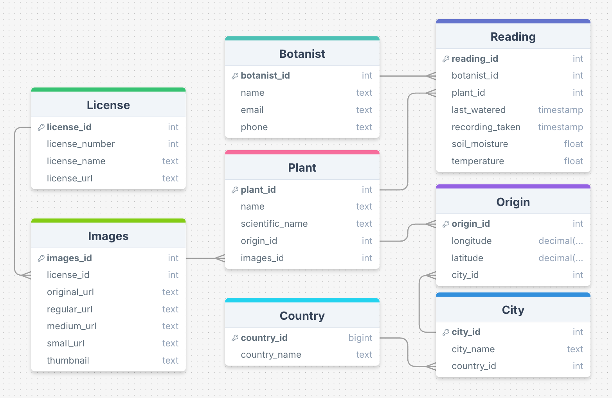

# LMNH-Group-Project 
> TO BE COMPLETED

# Project Description:
> What is this project for? What is the purpose here?

# How the project works:
> How does this project work? What does the code DO?

# How to run the code:
> Instructions on how to run the code (include examples?)

# ERD:

# Architecture Diagram
> Include architecture diagram

# Credits:
- Adam Cummings: Engineer & Analyst, Architect & DevOps
- Sami Lachqar: Engineer & Analyst, Architect & DevOps
- Ronn Marakkalsherry: Engineer & Analyst, Data & Business Analyst
- Dev Mukherjee: Engineer & Analyst, Project Manager
- Asia Siddiqi: Engineer & Analyst, QA Tester